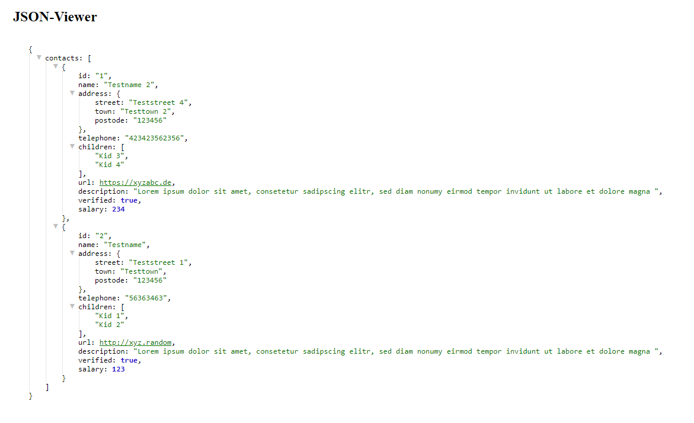

# JSON-Viewer

A Wicket Component that uses the jquery.json-viewer (https://github.com/abodelot/jquery.json-viewer).

Implementation inspired by Wicket-Bootstrap (https://github.com/l0rdn1kk0n/wicket-bootstrap).



## Use

1. Clone Project
2. Build
```bash
mvn clean install
```
3. Integrate Maven Dependency in your pom.xml

**Maven Dependency**
```xml
<dependency>
	<groupId>de.catcode</groupId>
	<artifactId>wicket-json-viewer</artifactId>
	<version>1.0-SNAPSHOT</version>
</dependency>
```

If you need a non Snapshot version you can set any version you want.

```bash
mvn versions:set -DnewVersion=<VersionYouWant>
mvn versions:commit
```

## Usage

```html
<div wicket:id="jsonViewer"></div>
```

```java
final JsonViewer jsonViewer = new JsonViewer("jsonViewer", jsonData);
add(jsonViewer);
```

Component configuration can be done like this:
```java
jsonViewer.getConfig().rootCollapsable(false);
```